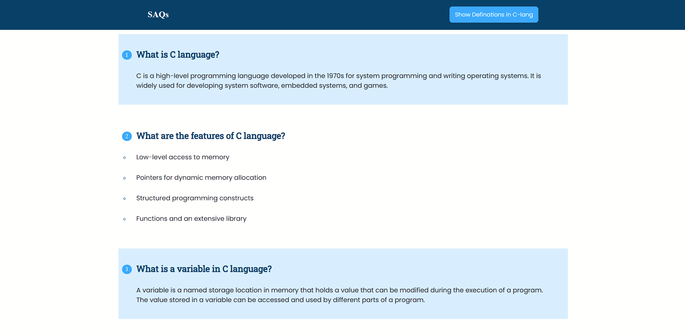

# C Language Notes Website

## Introduction

Welcome to the C Language Notes Website! This website is designed to help students studying C programming by providing important Short Answer Questions (SAQs) related to C language topics. As a student, this website greatly benefited my studies during college, and I hope it proves equally helpful to others.

## Features

- **Comprehensive SAQs**: The website offers a collection of carefully curated Short Answer Questions covering various C language concepts.

- **Easy Navigation**: The user-friendly interface allows students to quickly find specific topics and corresponding SAQs.

- **Responsive Design**: The website is optimized to function seamlessly on desktops, tablets, and mobile devices.

- **Search Functionality**: Students can easily search for specific questions or topics using the built-in search feature.

## Technologies Used

The website was built using the following technologies:

- **HTML**: Used for the overall structure and layout of the website.

- **CSS**: Employed for styling and visual enhancements, ensuring a pleasant user experience.
